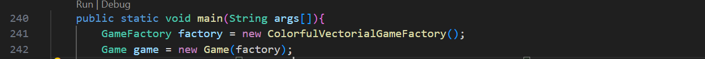
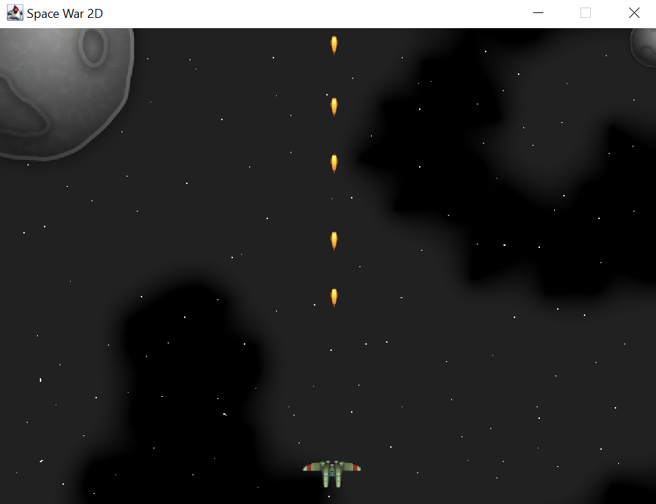
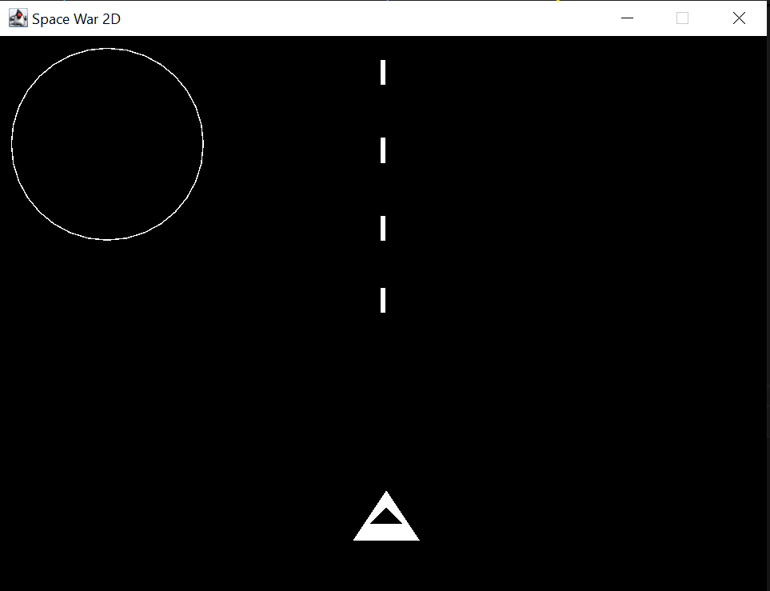
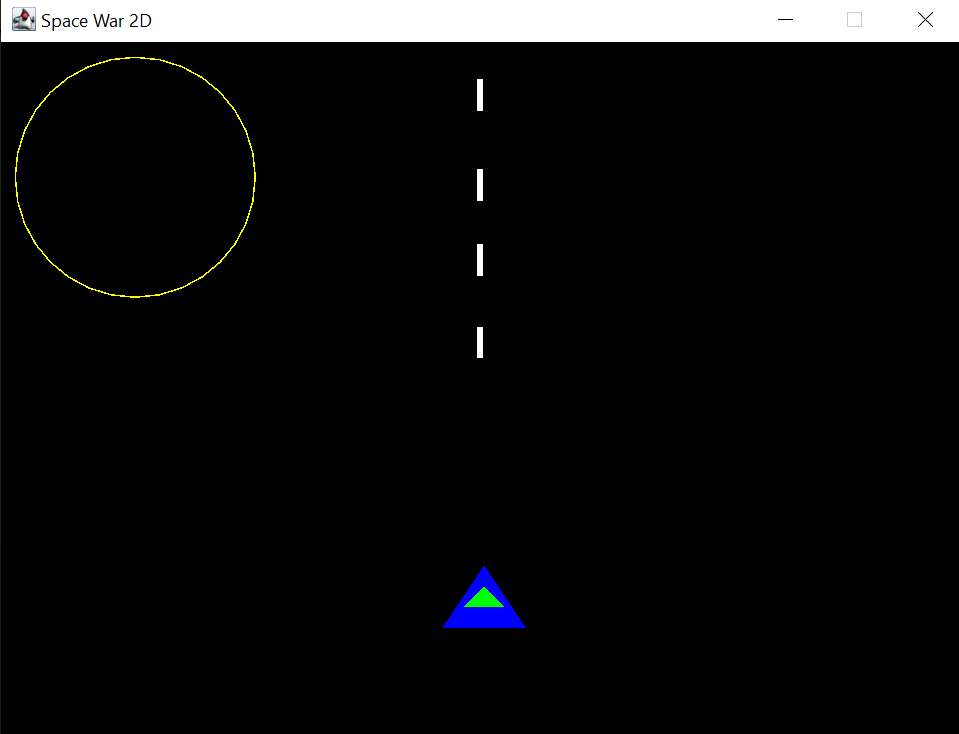

# Universidad de la Sabana
## Diseño y Arquitectura de Software


Juan José Rodríguez Falla

#### Imagenes. 



En la anterior imagen podemos observar que unicamente al cambiar el tipo de graficos se modifica el juego por su cuenta entre las opciones posibles esta: "VectorialGameFactory", "ColorfulVectorialGameFactory" y "SpritesGameFactory"

Demostraciones visuales:

Sprite:


Vectorial:


Colorful:



Para poder correr los videojuegos se deben de usar los siguientes codigos:
```
mvn clean compile -U
mvn exec:java -Dexec.mainClass="com.balitechy.spacewar.main.Game"
```